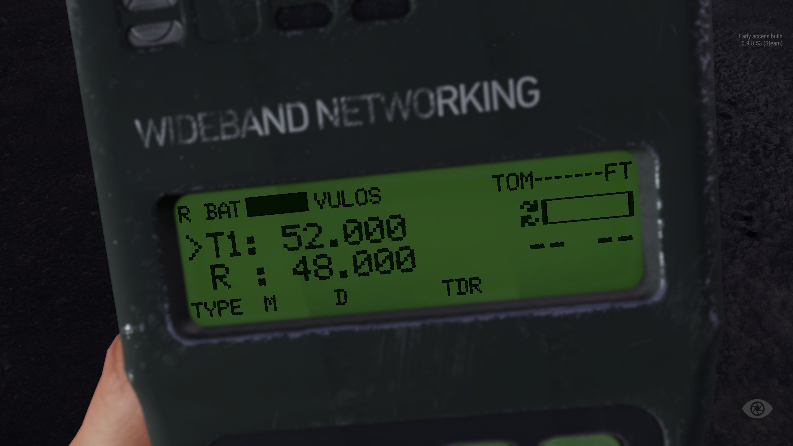

# AN / PRC 152


Introduced in **0.2.458**


## Introduction

The AN/PRC-152 Multiband Handheld Radio, also known as Falcon III, is a portable, compact, tactical software-defined combat-net radio manufactured by Harris Corporation. It is compliant without waivers to the Joint Tactical Radio System (JTRS) Software Communications Architecture (SCA). It has received NSA certification for the transmission of Top Secret data.


The designation AN/PRC signifies Army/Navy Portable Radio used for two way Communications and is based on the Joint Electronics Type Designation System guidelines.


## Interactive parts

| Part                   | Functionality                                                                                                                                         |
| ---------------------- | ----------------------------------------------------------------------------------------------------------------------------------------------------- |
| Power and channel knob | By rotating this knob you will be able to turn on the radio and set it to custom channel. Every position on knob is saving settings chosen from MENU. |
| Battery                | While operating radio you will notice that it drains battery. You will be able to change battery once you will have spare one on your inventory.      |
| Keypad                 | Is used to program and navigate on radio's menu and interact with it.                                                                                 |
| Antenna                | This part is responsible for the quality of transmission.                                                                                             |

## Operations

|                            |                                                                                                                                                                                                                                                                                                                                                                                                                                                                                                                                                                                                                                                                                                                                                                                                                                                                                                                                                                        |
| -------------------------- | ---------------------------------------------------------------------------------------------------------------------------------------------------------------------------------------------------------------------------------------------------------------------------------------------------------------------------------------------------------------------------------------------------------------------------------------------------------------------------------------------------------------------------------------------------------------------------------------------------------------------------------------------------------------------------------------------------------------------------------------------------------------------------------------------------------------------------------------------------------------------------------------------------------------------------------------------------------------------- |
| INTERACTION THROUGH THE UI | Until now if you used \[G]+\[R] it would say that it turned on the radio where in fact the radio would remain off and it wouldnt allow you to recieve or transmit any data... That chagnes with this update as not only you will be able to turn your radio ON or OFF with \[G]+\[R] but through the \[G] menu you will be able to chane current knob position using \[Scrollwheel] which in vanilla radios is used for frequency adjustment but dont worry as there are new ways for doing that, more on that later..                                                                                                                                                                                                                                                                                                                                                                                                                                                 |
| RADIO SCREEN               | Showing you the current radio settings and choose frequencies.                                                                                                                                                                                                                                                                                                                                                                                                                                                                                                                                                                                                                                                                                                                                                                                                                                                                                                         |
| MENU NAVIGATION            | Due to change the of functionality of \[PRE+/-] keys it was necessary to move menu navigation to \[ARROW LEFT/ RIGHT] which are also used for selecting predefined options                                                                                                                                                                                                                                                                                                                                                                                                                                                                                                                                                                                                                                                                                                                                                                                             |
| PRESETS                    | Since this update we separated KNOB positions from frequency PRESETS... this was done to prepare for upcoming content... with this shift comes change to how we use 152 as from now on buttons \[PRE +/-] are used for switching between presets which allows you to change what preset is used by currently selected knob position... when switching between presets there will be now a number changing next to active transmitter as it indicates what preset is selected... with that comes ability change what preset is assigned to currently selected knob position by usage of \[PRE+/-] keys                                                                                                                                                                                                                                                                                                                                                                  |
| NEW PRESETS                | By default 152 will have 5 presets that each will be assigned to corresponding knob position but with new menu position \[NEW PREset] you will be able to create up to 10 presets for all you comms needs                                                                                                                                                                                                                                                                                                                                                                                                                                                                                                                                                                                                                                                                                                                                                              |
| FREQUENCY ADJUSTMENT       | until now you would either use \[G] menu with your scroll wheel or \[PRE+/-] to adjust your radio frequency but now you will be doing that through usage of \[ARROW LEFT/ RIGHT] (when not in the radio menu) which will change the frequency by currently selected value specified in \[FREQuency RESolution] menu which allows you to adjust that value... Second way to change frequency is to manually input it through new menu position \[PREset FREQuency], here when you enter input mode you will be able to use radio keyboard to input new frequency for currently selected preset... additionally while we're here you can change currently selected preset and adjust it frequency without leaving the menu by using \[PRE+/-] buttons, this functionality is avialable for some other positions as well and you can recognise that by the fact that menu position will have letter 'P' with a number of currently selected preset on the left side of it |
| ENCRYPTION                 | Since the introduction of new presets we made it so each preset has its own encryption key that can be set via \[CUSTom KEY] menu and applied when given preset is selected... In addition to that when you apply new custom encryption key it will also switch usage of custom key for that preset which previously would have to be done separately through \[ENCryption KEY] menu which now is primarily used for switching it back to the default encryption key and for security reason it will also wipe previously entered encryption key... same as \[PREset FREQuency], for those options you can switch to different preset by pressing \[PRE+/-} keys and adjust its encryption without leaving the menu...                                                                                                                                                                                                                                                 |

## User interface

AN / PRC 152 has fairly cluttered user interface which might seem intimidating at first but at closer inspection it starts to be more reasonable. Starting from top left to the bottom right:

<figure><figcaption></figcaption></figure>

| UI Element                                     |                                                                                                                                                                                                                                                                                                                                                                                                                                                                                                                                                                                       |
| ---------------------------------------------- | ------------------------------------------------------------------------------------------------------------------------------------------------------------------------------------------------------------------------------------------------------------------------------------------------------------------------------------------------------------------------------------------------------------------------------------------------------------------------------------------------------------------------------------------------------------------------------------- |
| .png>)  | Condition indicator is there to provide information if radio is currently listening - indicated with letter **R** - or broadcasting - letter **T**                                                                                                                                                                                                                                                                                                                                                                                                                                    |
| .png>) | Battery status indicator that is fully black when battery is at 100%                                                                                                                                                                                                                                                                                                                                                                                                                                                                                                                  |
|         | Focus indicator that shows which element will be manipulated if user presses respective keys                                                                                                                                                                                                                                                                                                                                                                                                                                                                                          |
| .png>)  | Active transmitter preset indicator with number of currently selected preset                                                                                                                                                                                                                                                                                                                                                                                                                                                                                                          |
| .png>) | Frequency of selected preset                                                                                                                                                                                                                                                                                                                                                                                                                                                                                                                                                          |
| .png>)  | Transmission indicator - When user is broadcasting through the radio then only top (right) arrow will be visible and progress bar will be filled depending on the currently selected power mode. When user is not broadcasting and there is an incoming transmission then only bottom (left) arrow will be visible, in such case bar will depict incoming signal strength/ quality which is dependent on the distance to and power of that broadcasting radio. If there are no incoming or outgoing transmissions then the bar will be empty and both arrows are going to be visible. |
| .png>)  | Receiver frequency - due to 152 small size it is only capable to transmit signal only on one frequency and frequency marked with letter **R** is only for listening to that frequency which by default is set to US platoon frequency                                                                                                                                                                                                                                                                                                                                                 |
| .png>) | Power mode indicator - Depending on currently selected power mode UI will show **L** - LOW - or **M** - MEDIUM - or **H** - HIGH - to tell user of current radio range and power consumption                                                                                                                                                                                                                                                                                                                                                                                          |

When user is in radio menu then there are few changes to the UI:

<figure><figcaption>
Only elements that change will be described which in this case is the center area of the radio screen
</figcaption></figure>

|                                                |                                                                                                                                                                                                                                                                                                                                                                                                                                                                                      |
| ---------------------------------------------- | ------------------------------------------------------------------------------------------------------------------------------------------------------------------------------------------------------------------------------------------------------------------------------------------------------------------------------------------------------------------------------------------------------------------------------------------------------------------------------------ |
| .png>)  | Preset indicator - If such element is present then it means that changes made to this option will apply only to preset with that number. Additionally it also means that player can now switch to a different preset by pressing buttons \[PRE +] or \[PRE -] without leaving the menu.                                                                                                                                                                                              |
| .png>) | Position name and its number in the menu.                                                                                                                                                                                                                                                                                                                                                                                                                                            |
| .png>) | Focus indicator which in image above is showing that user is currently adjusting options of currently displayed position. By default indicator will be next to the top row to allow user togo to the next menu position by pressing buttons .png>) or.png>). If user would want to change option of selected position then to move focus he has press .png>). |
| .png>)  | Currently selected option for currently displayed position.                                                                                                                                                                                                                                                                                                                                                                                                                          |
|                                                |                                                                                                                                                                                                                                                                                                                                                                                                                                                                                      |
