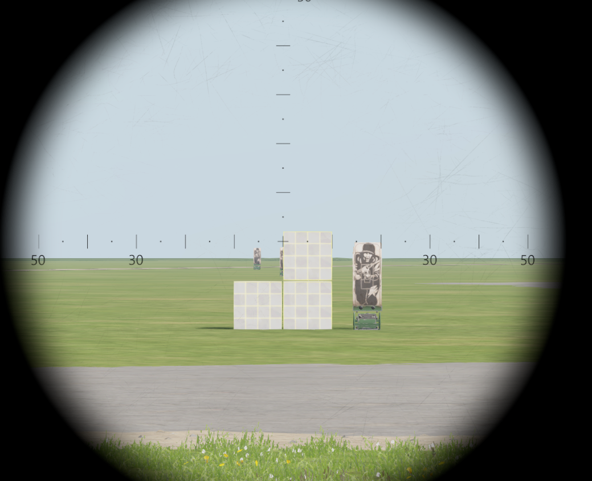

# AN/PEQ-16A

The AN/PEQ-16A is a military-grade laser aiming module designed for use with firearms. It is primarily used by the United States military and law enforcement agencies. The AN/PEQ-16A combines a visible red laser, an infrared laser, and an infrared illuminator into one compact unit, allowing for accurate aiming and target acquisition in a variety of lighting conditions. It also features a remote pressure switch for ease of use and can be mounted to a variety of weapons using its built-in Picatinny rail mount.

<figure><figcaption>
AN/PEQ-16A
</figcaption></figure>

## Operations

TBA

## Modes

TBA

<figure><figcaption></figcaption></figure>
