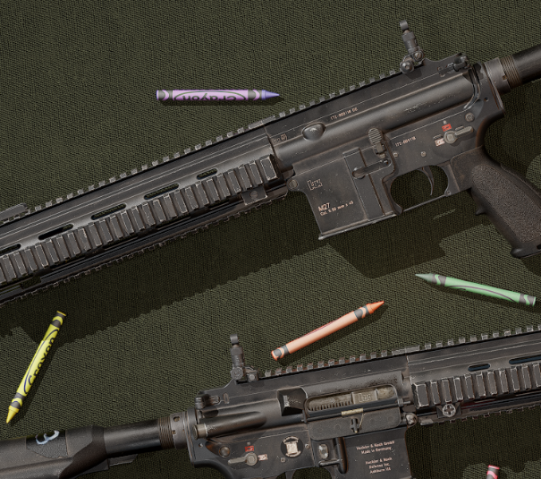

# M27 IAR

The M27 Infantry Automatic Rifle (IAR) is a lightweight, magazine-fed 5.56mm weapon used by the United States Marine Corps. It is intended to enhance an automatic rifleman's maneuverability and displacement speed, and it is used by the USMC to provide automatic, suppressive fire for infantry squads. The M27 is a variant of the Heckler & Koch HK416, and it was selected in 2010 to replace the M249 Squad Automatic Weapon (SAW) in Infantry and Light Armored Reconnaissance Battalions.

The M27 IAR is based on the HK416, which itself is a development of the M4 Carbine. It is a short-stroke gas piston system, a design that reduces the amount of heat and carbon fouling in the receiver, offering a higher degree of reliability compared to the direct impingement system used in traditional variants of the M4 and M16. Furthermore, it features a free-floating barrel for improved accuracy.

<figure><figcaption>
Crayolas are not included to M27 kit
</figcaption></figure>

The rifle comes standard with foldable iron sights that can be ranged from between 200m and 600m.

<figure><figcaption></figcaption></figure>

These sights can be also flipped independently, either through the [radial-menu.md](../../general-systems/radial-menu.md "mention") or the inspect function.

<figure><figcaption></figcaption></figure>
