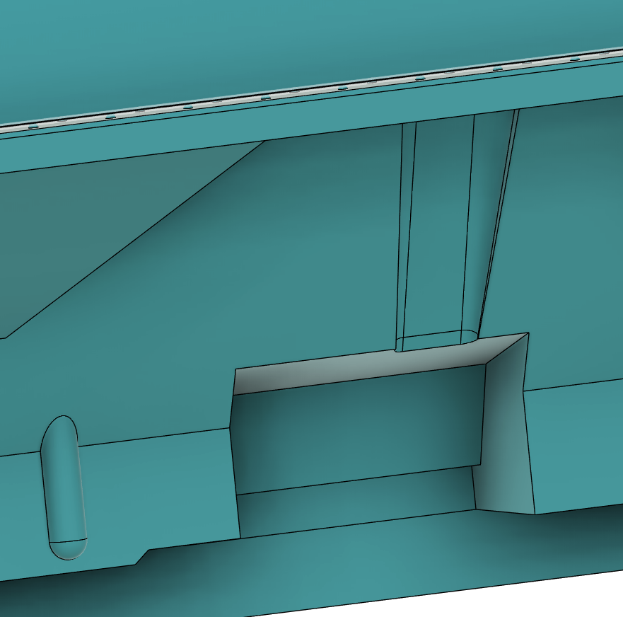

# RHS Extended Inventory System


Introduced in 0.3.951


You can use the inventory system and actions to attach and swap compatible items to clothing that you are wearing.

<figure><figcaption>
ECH helmet with attachments
</figcaption></figure>

If you are wearing an item of clothing that has slots compatible with an item that is available to pick up either from the ground or Arsenal simply approach it and use the actions that pop up or use the inventory and drag and drop them into the item of clothing.

<figure><figcaption>
Attached ECH items visible in the inventory
</figcaption></figure>

Currently compatible item types (attachment slots vary):

| Clothing Type | Attachable Items  |
| ------------- | ----------------- |
| Helmets       | NVG               |
|               | Balaclava         |
|               | Headsets          |
|               | Strobes           |
|               | NVG Battery Packs |
|               | Velcro Patches    |

<figure><figcaption>
Action to replace one balaclava with another
</figcaption></figure>

You can even add patches to appropriate velcro areas. Also, using quick actions you can grab items that are attached to clothing items that are laying on the ground (e.g. grabbing NVG directly off another helmet).

<figure><figcaption>
LShZ-1+ with RHS 20 Year patch and NVGs
</figcaption></figure>

To remove the items, simply remove them from the inventory slots of the clothing item, or alternatively use the [radial menu](radial-menu.md) to detach quickly.

<figure><figcaption>
Detaching items through radial menu
</figcaption></figure>
