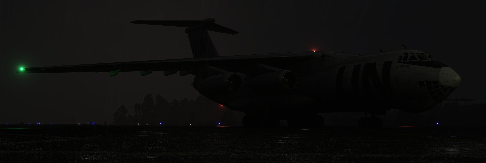

# Installation

<figure><figcaption></figcaption></figure>

## Reforger Workshop

### Stable

You can install the entire mod by finding and enabling it in the Reforger Workshop inside the game.



The changelog of all stable versions can be found in [Changelog](changelog.md) section.

### Experimental

The Experimental version of the mod is considered unstable releases for multiplayer and user testing and can be found here:



The experimental version is primarily intended for the RHS team to perform MP playability tests before stable releases and thus, at the moment, do not have official changelogs published.&#x20;


The experimental version can contain features that can cause serious problem and should not be used on servers that want to guarantee stability.


The experimental version is a preview of the next stable version and follows the same linear development branch.

<figure><figcaption></figcaption></figure>
