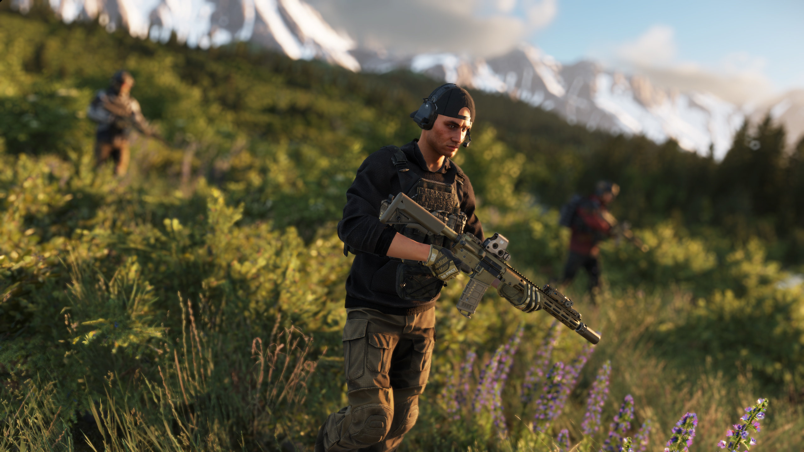
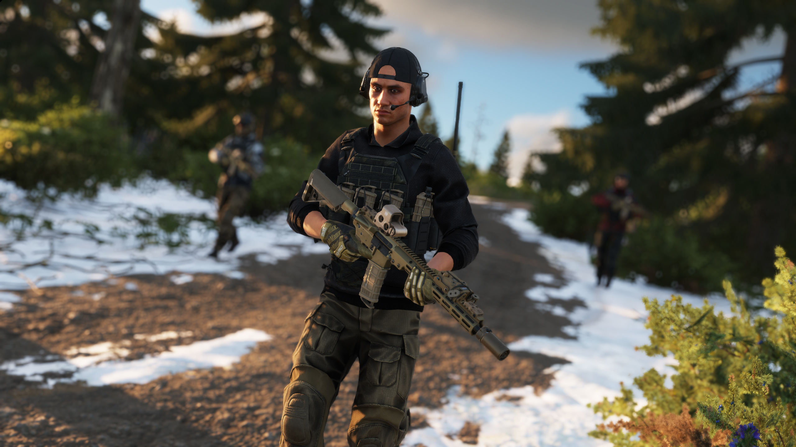

# Hoodie

**Overview:**\
The Military Tactical Hoodie is a versatile outer garment designed for comfort, concealment, and utility in both operational and casual settings. Constructed from durable, lightweight, and often moisture-wicking materials, it provides light insulation and weather resistance while incorporating practical features like zippered pockets, loop panels for patches, and reinforced elbows. Blending a civilian silhouette with tactical functionality, the hoodie is popular among military personnel, law enforcement, private security contractors, and outdoor enthusiasts.

<figure><figcaption></figcaption></figure>

**Development & Background:**\
The concept of a military-style hoodie emerged as operators sought low-profile, comfortable clothing options that could transition between covert operations, off-duty wear, and tactical use. Manufacturers began integrating utility features typically found on combat uniforms, such as MOLLE-compatible attachments, shoulder and forearm pockets, and hook-and-loop panels, into the familiar hoodie design. Depending on mission needs, tactical hoodies may use polyester blends, fleece lining, or softshell materials to balance breathability, warmth, and durability. Some versions include water-resistant coatings or infrared (IR) signature reduction fabrics for enhanced field performance.

<figure><figcaption></figcaption></figure>

**Service & Usage:**\
The Military Tactical Hoodie is widely used by special operations forces, plainclothes law enforcement units, private military contractors, and outdoor professionals. It is valued for its versatility in non-permissive environments, offering a blend of tactical function and casual appearance ideal for low-visibility missions, training exercises, or garrison wear. In the field, it serves as a lightweight insulating layer or outer shell in mild climates, often paired with plate carriers or chest rigs when armor is required. Its pockets and loop panels enable personalization and practical gear storage, making it a favored garment for everyday tactical readiness.
