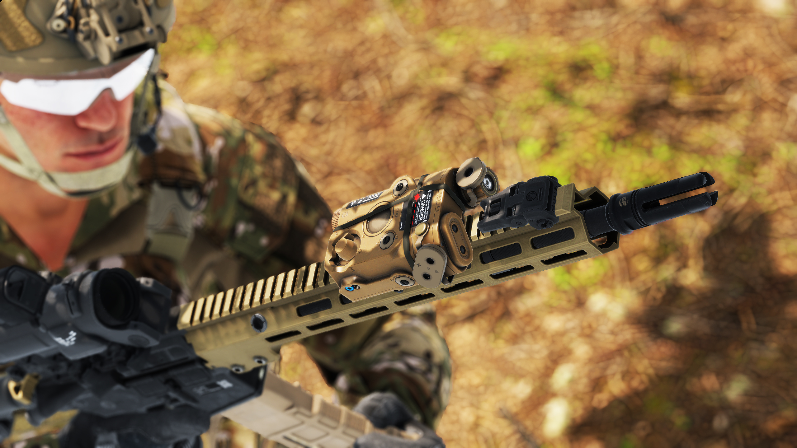
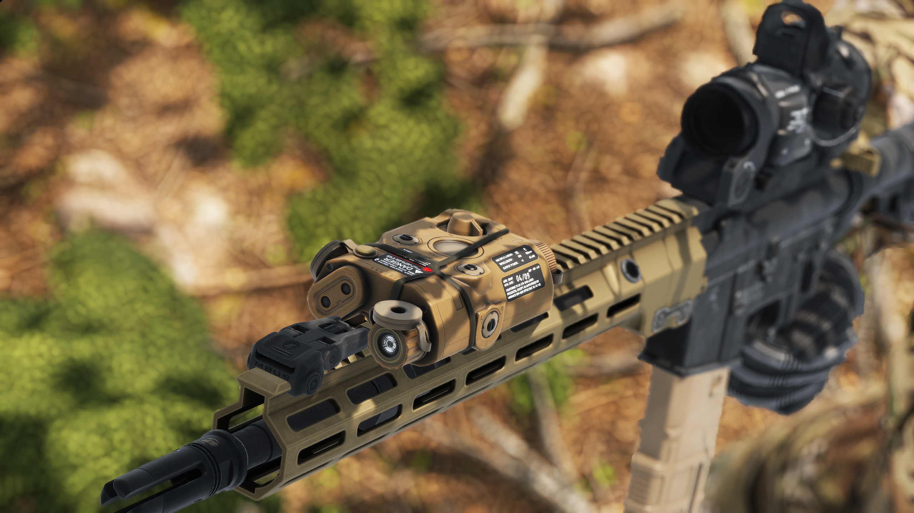

# AN/PEQ-15

**Overview:**\
The AN/PEQ-15 is a compact, multifunctional laser aiming device designed for military and law enforcement applications. It integrates a visible aiming laser, infrared (IR) laser, and IR illuminator, allowing for enhanced target acquisition in both day and night operations. The AN/PEQ-15 is mounted on Picatinny rail systems, making it compatible with a wide range of rifles and carbines.

<figure><figcaption></figcaption></figure>

**Development & Background:**\
The AN/PEQ-15 was developed to provide a lightweight, rugged, and mission-adaptable targeting system for infantry and special operations forces. It improves upon earlier laser aiming modules by incorporating adjustable laser settings, long-range infrared illumination, and enhanced durability for battlefield conditions. The device operates in both visible and infrared spectrums, making it highly effective for covert target acquisition when used with night vision devices (NVDs).

<figure><figcaption></figcaption></figure>

**Service & Usage:**\
The AN/PEQ-15 ATPIAL is widely used by military forces, special operations units, and law enforcement agencies, allowing operators to accurately aim and engage targets in low-light and night conditions. The infrared laser and illuminator enable precise engagement without exposing the user’s position to the naked eye, providing a significant tactical advantage. The visible laser assists in daytime targeting and quick engagements. Its compact and lightweight design ensures minimal impact on weapon handling, making it an essential tool for modern combat and law enforcement operations.
