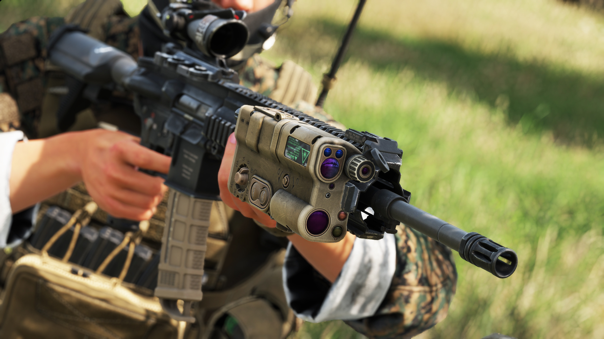
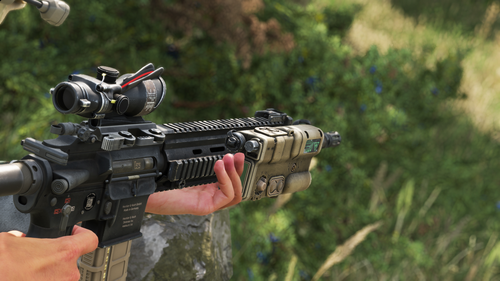

# AN/PSQ-23

**Overview:**\
The AN/PSQ-23 STORM is a compact, rifle-mounted laser rangefinder designed to enhance target acquisition and engagement accuracy for military personnel. It integrates a laser rangefinder, infrared (IR) aiming laser, visible aiming laser, and IR illuminator into a single unit, providing comprehensive targeting capabilities in various operational environments.

<figure><figcaption></figcaption></figure>

**Development & Background:**\
Developed to improve soldiers' effectiveness on the battlefield, the AN/PSQ-23 STORM allows for rapid and precise distance measurement to targets, facilitating accurate shot placement and fire coordination. Its integration of multiple functions reduces the need for separate devices, streamlining equipment and minimizing the weight burden on soldiers. The device is compatible with standard Picatinny rail systems, ensuring easy attachment to a variety of firearms.

<figure><figcaption></figcaption></figure>

**Service & Usage:**\
The AN/PSQ-23 STORM is widely used by military forces, particularly in infantry and special operations units. Its ability to provide accurate range data, along with visible and IR aiming capabilities, enhances situational awareness and engagement precision in both day and night operations. The device's compact design ensures it does not hinder weapon handling, making it a valuable tool for modern combat scenarios.
