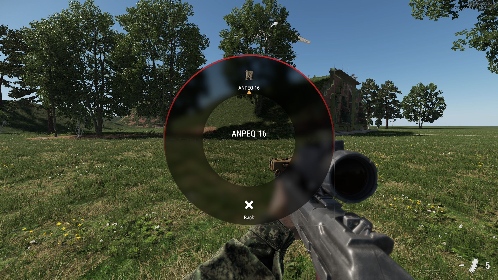
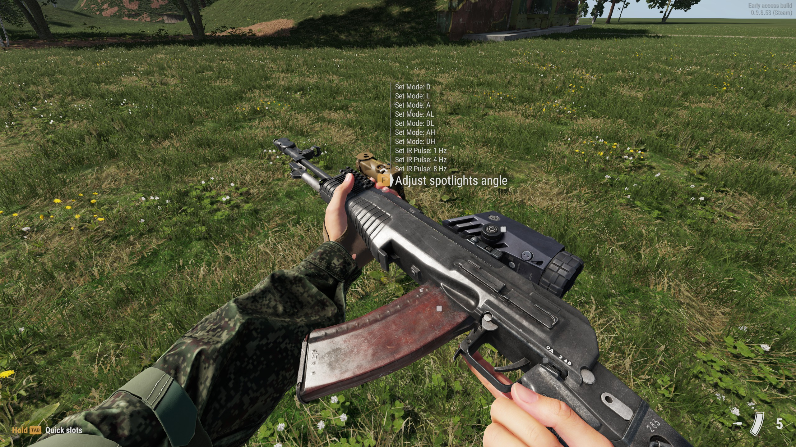

# AN/PEQ-15

The AN/PEQ-15, also known as the PEQ-15, is a military laser aiming device used by the U.S. Army and Navy. It incorporates visible and infrared lasers along with an infrared illuminator to enhance firearm accuracy, particularly in low-light and nighttime conditions. The visible laser aids daytime aiming, while the infrared components are utilized with night vision gear for precise targeting in complete darkness. The AN/PEQ-15 is commonly mounted on firearms for military and law enforcement applications, where accuracy and low-light performance are critical.

<figure><figcaption>
AN/PEQ-15
</figcaption></figure>

## Operations

The device can be turned on in two ways: `FIRE` and `ON`. When using `FIRE`, the device will turn on momentarily according to the selected mode and will switch off immediately. This can be used to give a quick signal to friendly forces.

When turning the device `ON`, the selected illuminator mode will be enabled. Turning the device `OFF` will disable all the illuminators.

## Modes


**Note:** IR lasers and illuminators can only be seen with appropriate optical devices, such as night vision goggles and scopes.


The AN/PEQ-15 can be set to the following modes:

<table><thead><tr><th>Mode</th><th width="492.3333333333333">Name</th><th>Description</th></tr></thead><tbody><tr><td>O</td><td>Off</td><td>The device is off, and pressing FIRE or ON will do nothing.</td></tr><tr><td>AL</td><td>Aim Low</td><td>Visible light laser</td></tr><tr><td>AL (IR)</td><td>Aim Low (IR)</td><td>Low gain IR laser</td></tr><tr><td>DL</td><td>Dual Low</td><td>Low gain IR laser, low gain IR illuminator (flashing in accordance with frequency setting).</td></tr><tr><td>AH</td><td>Aim High</td><td>High gain IR laser.</td></tr><tr><td>IH</td><td>Illuminator High</td><td>High gain IR illuminator (flashing in accordance with frequency setting).</td></tr><tr><td>DH</td><td>Dual High</td><td>High gain IR laser, high gain IR illuminator (flashing in accordance with frequency setting).</td></tr></tbody></table>

You can use the selector to set the mode before turning the device ON or during operation.

<figure><figcaption></figcaption></figure>

## IR Illuminator Frequency

The IR illuminator can be set to pulse at specific frequencies:

* Continuous
* 1 Hz
* 2 Hz
* 4 Hz
* 8 Hz

## Inspection actions

Most actions like for eg turning device On/Off or switching modes can be done via radial menu that by default can be brought up by holding \[**\\**] key.

<figure><figcaption>
Radial menu when ANPEQ-16 is attached to the weapon
</figcaption></figure>

Due to some limitations action that allows user to adjust illuminator cone angle is only available through traditional inspect action (or while device is on the ground) which users can get to by pressing \[**Ctrl**] + \[**R**]. From there user has to select that option by using \[Scroll]. In order to adjust the angle user has to hold \[**F**] and \[**Scroll**] just like it is in case of BTR viewport hatches.

<figure><figcaption>
This single action adjust visible, IR low power and IR high power illuminator cone angle
</figcaption></figure>

### Default key binds

Refer to [Default Key Bindings ](../../../../general-systems/default-key-binds.md)section.
