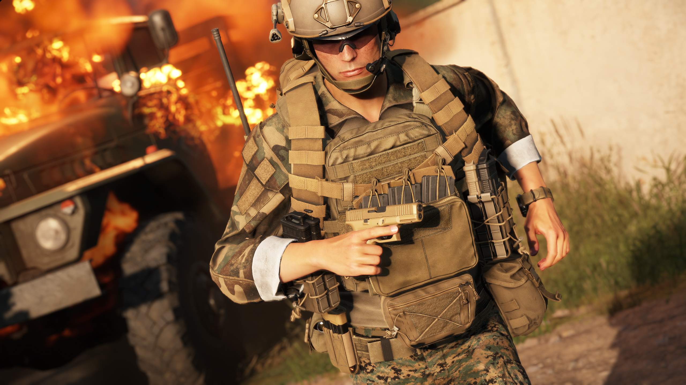

# Glock 45

**Overview:**\
The Glock 45 is a semi-automatic pistol chambered in 9x19mm, designed as a crossover pistol combining the full-size frame of the Glock 17 with the compact slide of the Glock 19. Featuring Gen5 upgrades, such as an ambidextrous slide release, flared magazine well, and improved trigger system, the Glock 45 is optimized for duty use and tactical applications.

<figure><figcaption></figcaption></figure>

**Development & Background:**\
The Glock 45 was developed as an evolution of the Glock 19X, originally designed for a U.S. military contract. Unlike the 19X, which features a coyote-coloured finish, the Glock 45 comes in an all-black design, tailored for law enforcement and tactical users. The crossover design allows for a larger grip surface for better control while retaining the shorter slide for improved maneuverability. With Gen5 enhancements, including the removal of finger grooves and a precision barrel, the Glock 45 provides an optimized balance between accuracy, capacity, and handling.

**Service & Usage:**\
The Glock 45 is widely adopted by law enforcement agencies, military units, and security forces, valued for its high-capacity magazine, modularity, and improved ergonomics. Its compatibility with red dot optics, suppressors, and tactical lights makes it highly adaptable for both defensive and offensive operations. The combination of a full-size grip for stability and a compact slide for quick handling makes the Glock 45 a preferred choice for duty carry and self-defence scenarios.

<table data-full-width="false"><thead><tr><th>Category</th><th>Data</th></tr></thead><tbody><tr><td>Weapon Type:</td><td>Pistol</td></tr><tr><td>Calibre:</td><td></td></tr><tr><td>Length:</td><td></td></tr><tr><td>Weight:</td><td></td></tr><tr><td>Item Volume:</td><td></td></tr><tr><td>Barrel:</td><td></td></tr><tr><td>Sights:</td><td></td></tr><tr><td>Optics:</td><td></td></tr><tr><td>Rail System:</td><td></td></tr><tr><td>Buttstock:</td><td></td></tr><tr><td>Selector:</td><td></td></tr><tr><td>Muzzle Velocity:</td><td></td></tr><tr><td>Weapon Dispersion:</td><td></td></tr><tr><td>Variants (RHS):</td><td></td></tr><tr><td>Factions Arsenal:</td><td>RHS USAF</td></tr></tbody></table>

