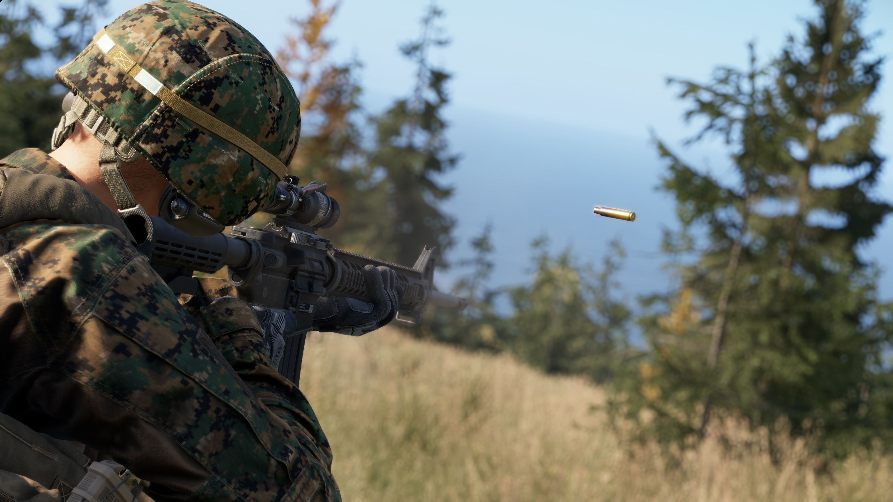
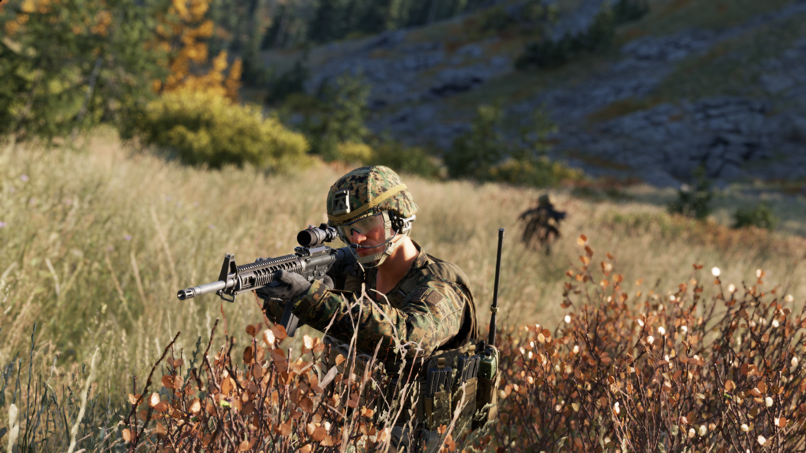

# M16A4

**Overview:**\
The **M16A4** is a **5.56×45mm NATO, magazine-fed, selective-fire rifle** and the **final evolution of the M16 family** adopted by the U.S. military. It features a **20-inch barrel**, a **flat-top upper receiver with a MIL-STD-1913 Picatinny rail**, and supports the attachment of modern optics, aiming devices, and accessories. The M16A4 combines the **range and accuracy of a full-length rifle** with **modular flexibility**, making it a standard-issue weapon for many units throughout the 2000s.

<figure><figcaption></figcaption></figure>

**Development & Background:**\
The M16A4 was introduced in the **late 1990s to early 2000s** as an upgrade over the M16A2, incorporating feedback from troops engaged in increasingly urban and modular combat environments. Its **flat-top receiver** replaced the fixed carry handle, enabling the use of **optical sights such as the ACOG, EOTech, or Aimpoint**, while maintaining compatibility with **iron sights via detachable carry handles**. The rifle retained the **three-round burst fire mode** from the M16A2, rather than adopting full-auto capability like its shorter cousin, the M4A1. It was commonly paired with the **M5 RAS (Rail Adapter System)** handguard, allowing for the attachment of **vertical grips, lights, and lasers**.

<figure><figcaption></figcaption></figure>

**Service & Usage:**\
The M16A4 became a standard-issue rifle for the **U.S. Marine Corps** and select **U.S. Army units** during the **Global War on Terror**, particularly in **Iraq and Afghanistan**. Its **long barrel and high muzzle velocity** provided **superior range and accuracy**, making it well-suited for **open terrain engagements**. Marines appreciated the rifle’s performance in **mid- to long-range firefights**, although its length was occasionally a drawback in **close quarters or mounted operations**. As newer rifles like the M27 IAR began to replace it, the M16A4 remained in service for training, reserve units, and allied forces, demonstrating its enduring reliability and accuracy.\

<figure><figcaption></figcaption></figure>

<table><thead><tr><th width="203"></th><th></th></tr></thead><tbody><tr><td>Weapon Type:</td><td>Assault Rifle</td></tr><tr><td>Calibre:</td><td>5.56x45mm</td></tr><tr><td>Length:</td><td></td></tr><tr><td>Barrel:</td><td></td></tr><tr><td>Sights:</td><td></td></tr><tr><td>Optics:</td><td></td></tr><tr><td>Rail System:</td><td></td></tr><tr><td>Buttstock:</td><td></td></tr><tr><td>Selector:</td><td></td></tr><tr><td>Magazine:</td><td></td></tr><tr><td>Muzzle Velocity:</td><td></td></tr><tr><td>Variants (RHS):</td><td></td></tr><tr><td>Factions Arsenal:</td><td>RHS USMC</td></tr></tbody></table>

