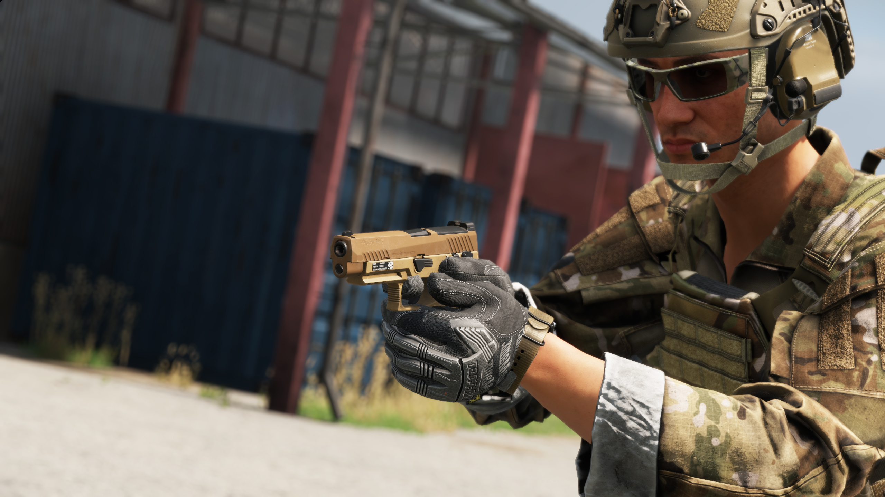

# M17

**Overview:**\
The M17 is a semi-automatic, striker-fired pistol chambered in 9x19mm, designed as the standard-issue sidearm for the U.S. military. Based on a modular handgun system (MHS), the M17 replaces the M9 pistol, offering enhanced ergonomics, improved reliability, and greater adaptability for modern combat requirements.

<figure><figcaption></figcaption></figure>

**Development & Background:**\
The M17 was developed as part of the U.S. Army’s Modular Handgun System (MHS) program, which sought to replace the aging Beretta M9. The design incorporates a polymer frame with an interchangeable fire control unit (FCU), allowing for easy customization of grip sizes and configurations. It features a striker-fired mechanism, a manual safety, and a high-capacity magazine, improving usability and effectiveness in combat environments. The M17 is based on a full-sized pistol design, while its M18 counterpart is a compact variant intended for military police and special forces.

**Service & Usage:**\
Adopted by the U.S. Army, Navy, Air Force, and Marine Corps, the M17 has quickly become a trusted service pistol due to its accuracy, modularity, and durability. It is compatible with red dot optics, suppressors, and weapon-mounted lights, making it an adaptable platform for both standard troops and specialized units. The M17’s enhanced ergonomics and reliability ensure its effectiveness in both military and law enforcement roles, solidifying its place as a next-generation combat sidearm.

<table data-full-width="false"><thead><tr><th>Category</th><th>Data</th></tr></thead><tbody><tr><td>Weapon Type:</td><td>Pistol</td></tr><tr><td>Calibre:</td><td></td></tr><tr><td>Length:</td><td></td></tr><tr><td>Weight:</td><td></td></tr><tr><td>Item Volume:</td><td></td></tr><tr><td>Barrel:</td><td></td></tr><tr><td>Sights:</td><td></td></tr><tr><td>Optics:</td><td></td></tr><tr><td>Rail System:</td><td></td></tr><tr><td>Buttstock:</td><td></td></tr><tr><td>Selector:</td><td></td></tr><tr><td>Muzzle Velocity:</td><td></td></tr><tr><td>Weapon Dispersion:</td><td></td></tr><tr><td>Variants (RHS):</td><td></td></tr><tr><td>Factions Arsenal:</td><td>RHS USAF</td></tr></tbody></table>

