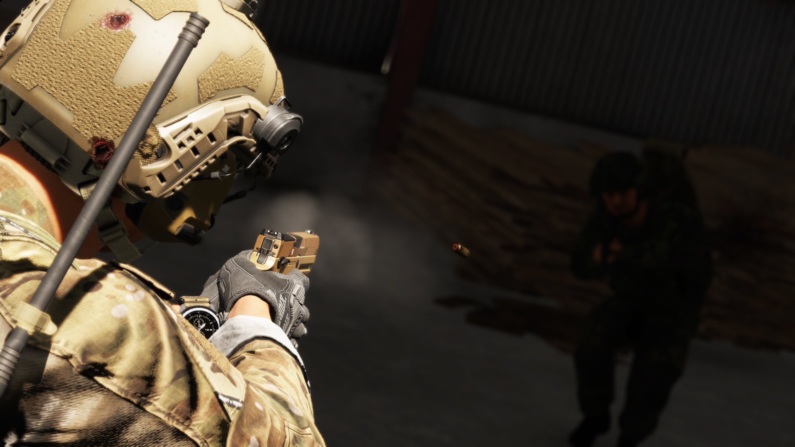
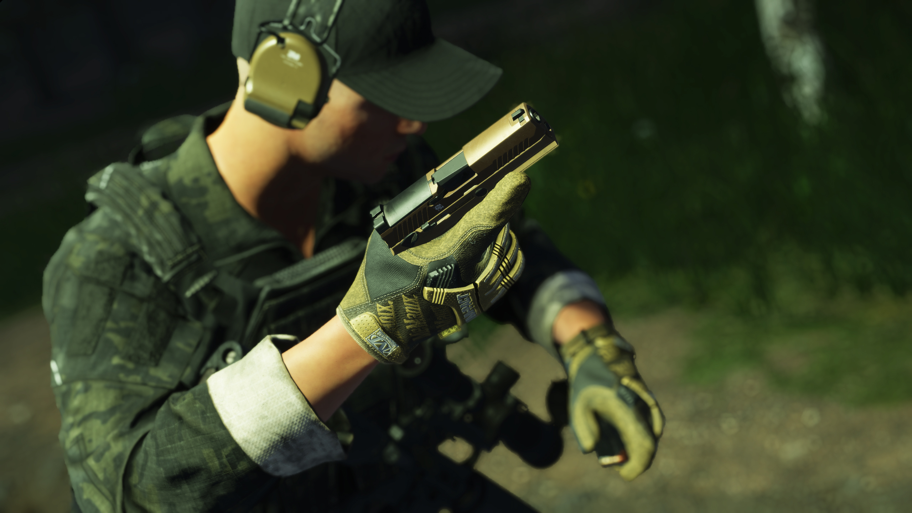

# M18

**Overview:**\
The M18 is a compact, semi-automatic, striker-fired pistol chambered in 9x19mm, designed as part of the U.S. military’s Modular Handgun System (MHS). It serves as the compact variant of the M17, offering the same modularity, reliability, and performance in a more concealable and lightweight package.

<figure><figcaption></figcaption></figure>

**Development & Background:**\
The M18 was developed alongside the M17 to replace the Beretta M9 as the standard sidearm for the U.S. military. While the M17 is a full-sized pistol, the M18 features a shorter barrel and slide, making it more manoeuvrable while maintaining the same fire control unit (FCU) and modular grip system. This modularity allows operators to swap frames and configurations based on mission requirements. The striker-fired system, improved trigger design, and high-capacity magazine options enhance the pistol’s effectiveness in combat and defensive roles.

<figure><figcaption></figcaption></figure>

**Service & Usage:**\
The M18 has been widely adopted by U.S. military branches, including the Marine Corps, Air Force, and Navy, where a compact sidearm is preferred for military police, pilots, and special operations personnel. It is designed to be optics-ready, compatible with red dot sights, suppressors, and tactical lights, making it an adaptive and modern combat pistol. Its smaller size compared to the M17 makes it ideal for concealed carry and close-quarters engagements, while still maintaining the accuracy and reliability required for duty use.

<table data-full-width="false"><thead><tr><th>Category</th><th>Data</th></tr></thead><tbody><tr><td>Weapon Type:</td><td>Pistol</td></tr><tr><td>Calibre:</td><td></td></tr><tr><td>Length:</td><td></td></tr><tr><td>Weight:</td><td></td></tr><tr><td>Item Volume:</td><td></td></tr><tr><td>Barrel:</td><td></td></tr><tr><td>Sights:</td><td></td></tr><tr><td>Optics:</td><td></td></tr><tr><td>Rail System:</td><td></td></tr><tr><td>Buttstock:</td><td></td></tr><tr><td>Selector:</td><td></td></tr><tr><td>Muzzle Velocity:</td><td></td></tr><tr><td>Weapon Dispersion:</td><td></td></tr><tr><td>Variants (RHS):</td><td></td></tr><tr><td>Factions Arsenal:</td><td>RHS USAF</td></tr></tbody></table>

