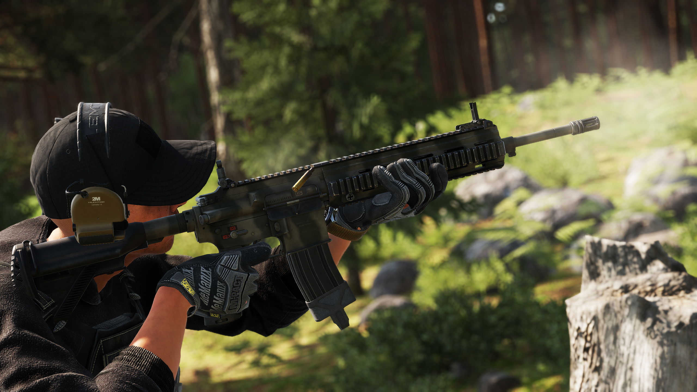

# M27

**Overview:**\
The M27 Infantry Automatic Rifle (IAR) is a 5.56x45mm NATO gas-operated, magazine-fed automatic rifle designed to provide squad-level suppressive fire while maintaining the accuracy and manoeuvrability of a standard infantry rifle. Intended to replace the M249 SAW in certain roles, the M27 offers greater precision, reduced weight, and improved reliability in both automatic and semi-automatic fire.

<figure><figcaption></figcaption></figure>

**Development & Background:**\
The M27 IAR was developed as part of the United States Marine Corps (USMC) Infantry Automatic Rifle program, aiming to replace the belt-fed M249 SAW with a lighter, more versatile weapon. Based on the HK416 platform, the M27 utilizes a short-stroke gas piston system, which improves reliability by reducing fouling in the receiver compared to traditional direct impingement systems. The rifle is equipped with a free-floating barrel, enhancing accuracy, and a quad-rail handguard, allowing for attachment of optics, grips, and accessories.

<figure><figcaption></figcaption></figure>

**Service & Usage:**\
The **M27 IAR** was officially adopted by the **USMC in 2011**, initially intended as a **squad automatic weapon** but later expanded into the role of a **standard-issue infantry rifle**. It is highly regarded for its **accuracy, controllability, and ability to maintain sustained fire** with standard **30-round magazines** or **larger-capacity drum magazines**. The rifle is widely used in **both conventional and special operations**, excelling in **urban, jungle, and open-field combat scenarios**. Its precision and adaptability have led to considerations for its adoption in a broader capacity across military forces.

<table data-full-width="false"><thead><tr><th>Category</th><th>Data</th></tr></thead><tbody><tr><td>Weapon Type:</td><td>Assault Rifle</td></tr><tr><td>Calibre:</td><td>5.56x45</td></tr><tr><td>Length:</td><td>850 - 952 mm</td></tr><tr><td>Weight:</td><td>TBA</td></tr><tr><td>Item Volume:</td><td>TBA</td></tr><tr><td>Barrel:</td><td>419 mm</td></tr><tr><td>Sights:</td><td>KAC Iron Sights - BUIS</td></tr><tr><td>Optics:</td><td>N/A</td></tr><tr><td>Rail System:</td><td>1-piece quad (M1913 Picatinny) Free Floating Rail System</td></tr><tr><td>Buttstock:</td><td>6-position adjustable with storage space</td></tr><tr><td>Selector:</td><td>Safe, Single, Auto</td></tr><tr><td>Muzzle Velocity:</td><td>TBA</td></tr><tr><td>Weapon Dispersion:</td><td>TBA</td></tr><tr><td>Variants (RHS):</td><td>TBA</td></tr><tr><td>Factions Arsenal:</td><td>RHS USAF</td></tr></tbody></table>


