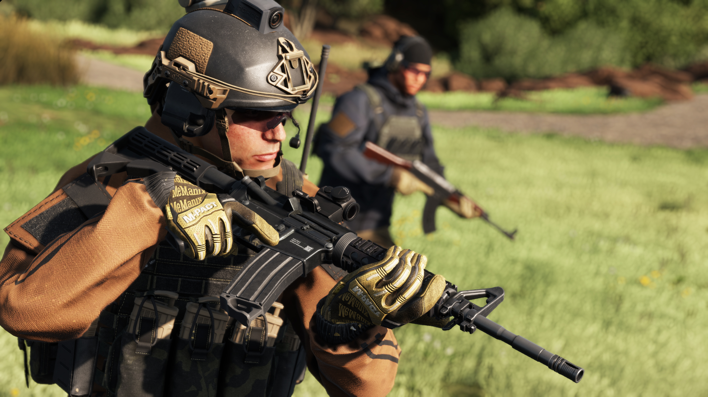
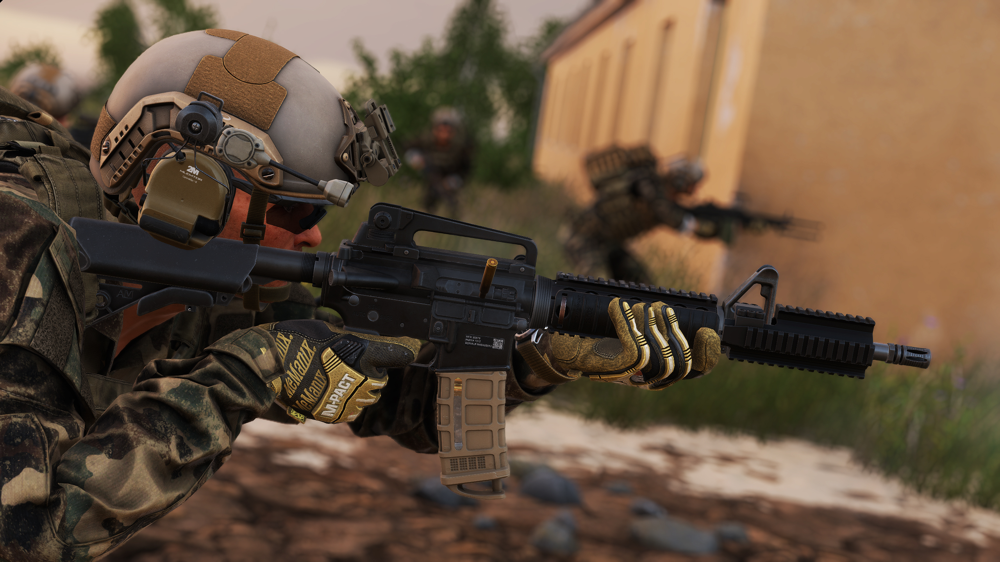

# M4A1

**Overview:**\
The M4A1 is a select-fire carbine chambered in 5.56x45mm, designed for versatility in modern combat environments. Featuring a shorter barrel than the M16, a collapsible stock, and full-automatic capability, the M4A1 is optimized for close-quarters combat (CQC) while maintaining effectiveness at medium ranges. Its modular design allows for extensive customization with optics, foregrips, suppressors, and other attachments.

<figure><figcaption></figcaption></figure>

**Development & Background:**\
The M4A1 was developed as an improvement over the standard M4 carbine, primarily for special operations forces requiring increased durability and a fully automatic fire mode. It traces its lineage to the M16 rifle family, benefiting from decades of refinement in reliability, accuracy, and adaptability. The carbine’s 14.5-inch barrel and gas-operated, direct impingement system provide a balance of mobility and firepower, making it a preferred choice for troops operating in urban, jungle, and mountainous terrains.

<figure><figcaption></figcaption></figure>

**Service & Usage:**\
The M4A1 has become the standard-issue carbine for many military units and special operations forces, replacing older rifle models due to its compact size, reduced weight, and improved handling in confined spaces. Its Picatinny rail system allows for the integration of advanced optics, lasers, and other mission-specific attachments, making it adaptable to a wide range of combat scenarios. The M4A1 remains a highly regarded primary weapon in modern infantry and special operations roles, providing a balance of firepower, manoeuvrability, and modularity.\

<table><thead><tr><th width="203"></th><th></th></tr></thead><tbody><tr><td>Weapon Type:</td><td>Assault Rifle</td></tr><tr><td>Calibre:</td><td></td></tr><tr><td>Length:</td><td></td></tr><tr><td>Barrel:</td><td></td></tr><tr><td>Sights:</td><td></td></tr><tr><td>Optics:</td><td></td></tr><tr><td>Rail System:</td><td></td></tr><tr><td>Buttstock:</td><td></td></tr><tr><td>Selector:</td><td></td></tr><tr><td>Magazine:</td><td></td></tr><tr><td>Muzzle Velocity:</td><td></td></tr><tr><td>Variants (RHS):</td><td></td></tr><tr><td>Factions Arsenal:</td><td>RHS USMC, RHS ION</td></tr></tbody></table>

