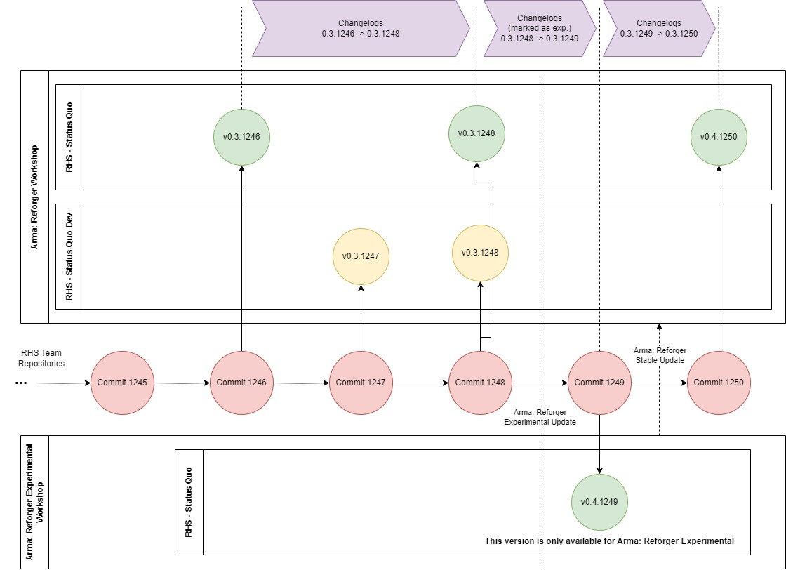

# Installation

The are various versions of RHS: Status Quo available for download. Please read carefully below.

### Stable

You can install the entire mod by finding and enabling it in the Reforger Workshop inside the game.



The changelog of all stable versions can be found in [Changelog](changelog.md) section.

### Dev

The Dev version of the mod is considered unstable releases for multiplayer and user testing and can be found here:



The Dev version is primarily intended for the RHS team to perform MP playability tests before stable releases and thus, at the moment, do not have official changelogs published.


The Dev version can contain features that can cause serious problem and should not be used on servers that want to guarantee stability.


The Dev version is a preview of the next stable version and follows the same linear development branch.

### Stable on Reforger Experimental

The third branch of RHS: Status Quo is located on in the workshop of Arma: Reforger Experimental. This workshop is separate from the normal Arma: Reforger workshop and releases of RHS can be made there independently.

Experimental releases are indicated in the [Changelog](changelog.md) using the following info box:

<figure><figcaption></figcaption></figure>

The diagram below demonstrates the various release streams.

<figure><figcaption>
Release Streams
</figcaption></figure>

If stable RHS: Status Quo release is preceded by one or more experimental releases (not dev), then the changelog between this stable release and last stable release should be considered the combination of all the experimental changelogs in between as well as the changelog between the last experimental and stable release.

### Versioning

The version numbers are in the format xx.yy.cc where **cc** always represents the commit revision number from which the release is made. The major **xx** and minor **yy** version numbers are updated at the behest of the team, with the minor number usually being updated when API changes are introduced or when Arma: Reforger opens a new experimental stream. The major number will be incremented at significant milestones in the development. The numbers in very position can be incremented indefinitely, thus a version 0.137.35294 is perfectly valid.
