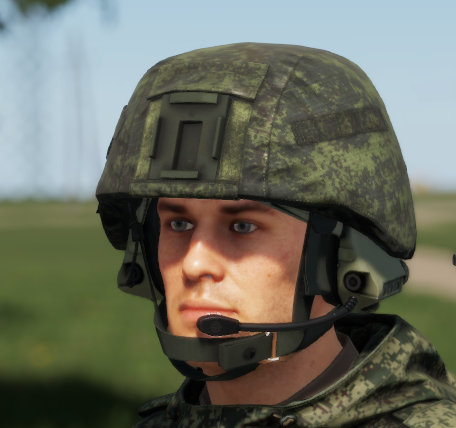

# 6B47


Introduced in **0.2.414**


The 6B47 helmet, made from aramid, bears resemblance to earlier generation helmets like the 6B7-1M and 6B27. Although it maintains comparable protection, it possesses a slightly lighter weight, has the ability to float in water, and comes equipped with mounting fixtures for lights and night vision devices. The helmet can be adapted with numerous covers to match varying environments. Additionally, it is a standard issue within the Ratnik system.

<figure><figcaption>
6B47 with 6M2-1
</figcaption></figure>

The helmet is compatible with the [rhs-extended-inventory-system.md](../../../general-systems/rhs-extended-inventory-system.md "mention")and can mount NVGs and headsets.
