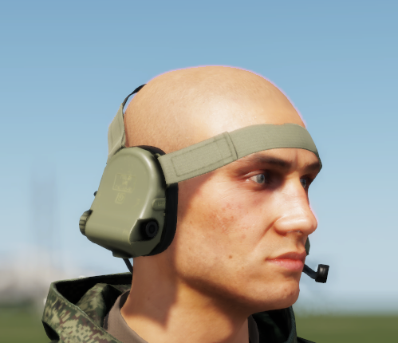

# 6M2


Introduced in **0.2.414**


The GSSh-01 6M2 headset, integrated into the Ratnik combat system, is designed for use with helmets and stands as a pivotal component in Russian tactical gear. This headset facilitates situational awareness by mitigating loud noises, such as gunshots and explosions, while simultaneously amplifying subtle sounds typically imperceptible to the unaided human ear. In essence, it employs built-in microphones to elevate quiet noises and suppresses pronounced ones, such as firearm discharges.

The 6M2-1 has a built in microphone and can interface to a communication system like the Azart directly.


This headset can be placed into helmets that support them through the [RHS Extended Inventory System](../../../general-systems/rhs-extended-inventory-system.md).


<figure><figcaption>
6M2-1
</figcaption></figure>
