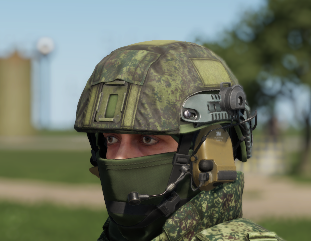

# LShZ 1+


Introduced in **0.2.414**


The LShZ 1+ helmet, utilized by Russian special forces units, is a combat helmet produced by Armocom and first publicly introduced in 2012. Upon initial observation, it bears a resemblance to the Ops-Core FAST helmet.

<figure><figcaption>
LShZ 1+
</figcaption></figure>

The helmet is compatible with the [rhs-extended-inventory-system.md](../../../general-systems/rhs-extended-inventory-system.md "mention")and can mount NVGs and Velcro attachments when Velcro is present.

Various High and Low Cut versions are available.
