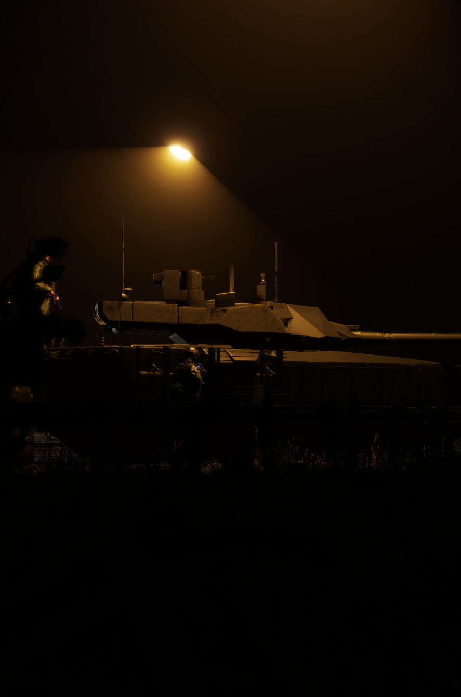
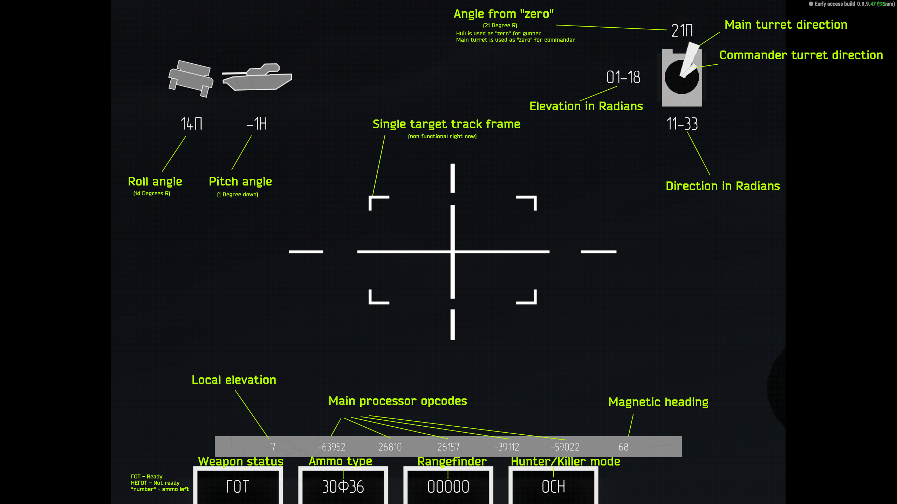

# T-14


Introduced in 0.2.648


<figure><figcaption></figcaption></figure>


In version 0.4.1149 T-14 Hud was remade from scratch, here is a small guide how to use it.


<figure><figcaption>
New T-14 Hud
</figcaption></figure>
