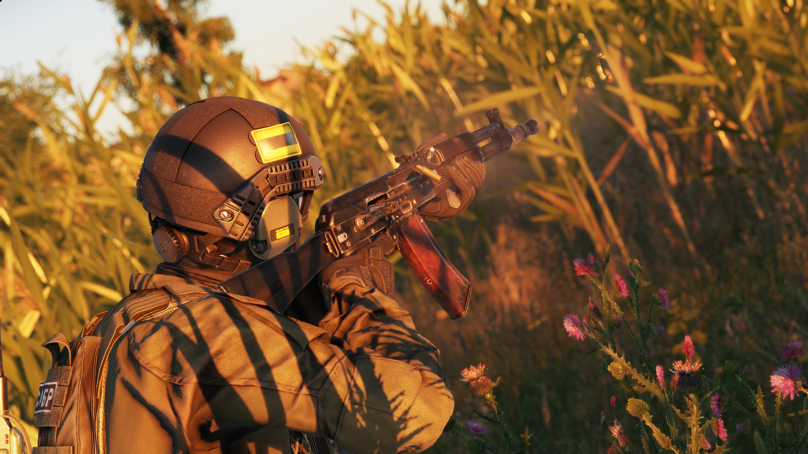

# AK-105

**Overview:**\
The AK-105 is a modernized carbine variant of the AK-74M, chambered in 5.45x39mm. Designed for improved manoeuvrability while maintaining the reliability of its predecessors, the AK-105 is a compact yet capable firearm favoured for various operational roles.

**Development & Background:**\
The AK-105 is part of the **AK-100 series**, a line of modernized rifles based on the classic AK platform. The series offers different calibres and barrel lengths to suit a variety of combat scenarios. The AK-105 specifically fills the role of a **short-barrelled assault rifle**, providing a balance between the full-length **AK-74M** and the **AKS-74U**, which is designed primarily for close-quarters engagements.

**Service & Usage:**\
The AK-105 is widely used in **urban warfare, vehicle operations, and airborne deployments**, offering an adaptable platform for various combat environments. Its compact size and reliability make it ideal for forces requiring a balance between mobility and firepower.

<figure><figcaption>
AK-105
</figcaption></figure>

<table data-full-width="false"><thead><tr><th>Category</th><th>Data</th></tr></thead><tbody><tr><td>Weapon Type:</td><td>Assault Rifle</td></tr><tr><td>Calibre:</td><td>5.45x39</td></tr><tr><td>Length:</td><td></td></tr><tr><td>Barrel:</td><td></td></tr><tr><td>Sights:</td><td>Iron Sights - Open/Slotted</td></tr><tr><td>Optics:</td><td>N/A</td></tr><tr><td>Rail System:</td><td>Dovetail Side Rail</td></tr><tr><td>Buttstock:</td><td>Folding / polymer or skeletonized / non-adjustable</td></tr><tr><td>Selector:</td><td>Safe, Single, Auto</td></tr><tr><td>Magazine:</td><td></td></tr><tr><td>Muzzle Velocity:</td><td><ul><li>7N22: 890.92 m/s</li><li>7N10: 887.88 m/s</li><li>7T3: 884.13 m/s</li></ul>
*Note: Muzzle velocity average measured based on firing 5 rounds. 
</td></tr><tr><td>Variants (RHS):</td><td>AK-105 B10M, AK-105 B10M B19, AK-105 B30U B31, AK-105 B30U B19N, AK-105 NPZ Rail, AK-105 NPZ B10M, AK-105 NPZ B10M B19, AK-105 B30U B31N, AK-105 B30U B31N, AK-105 B30U B19</td></tr><tr><td>Factions Arsenal:</td><td>RHS AFRF</td></tr></tbody></table>

