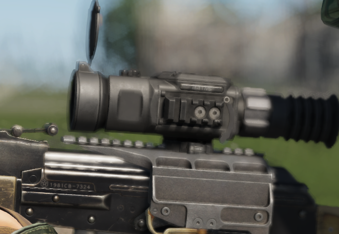

# INFRATECH TWS-1


Introduced in **0.3.787**


INFRATECH IT-1TWS has a minimum weight of only 680 grams and the latest high-resolution matrix, which makes this model the most advanced thermal imaging sight on the Russian market. Thermal imaging scopes are significantly superior to night vision scopes in all respects. To obtain a clear image, the sight does not require any lighting, which makes it possible to use the sight in complete darkness. An important advantage is the ability to detect various objects behind thick grass, bushes, tree branches, and it is also possible to hunt in difficult weather conditions during rain, snow and fog.

It is made on the basis of a high-resolution 640x480 matrix with a pixel size of 17 microns. The 50mm lens has an excellent balance between high aperture and compact size. All these characteristics make it possible to detect objects at a distance of up to 1800 meters, clear recognition is possible at a distance of up to 1100 meters. A fixed 1.7x magnification with optional digital magnification of 2x, 4x and 8x makes the scope an ideal tool for short to medium range hunting.

<figure><figcaption>
IT-1TWS
</figcaption></figure>

The sight uses a fake Thermal overlay for the time being.

<figure><figcaption>
"Thermal" View
</figcaption></figure>


Read more about "pseudo thermals" [Here](../../../general-systems/rhs-ir-and-nv.md#thermals)

