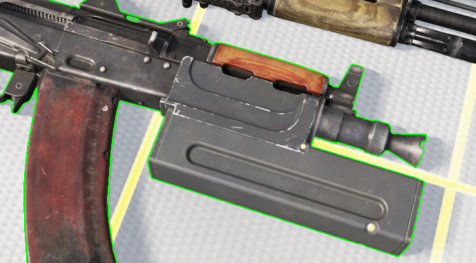

# LTSU-1


Introduced in **0.4.1026**


Laser device that is capable of emitting visible laser of orange color and is mountable on the AKS-74U.

<figure><figcaption></figcaption></figure>

### Default key bind

LTSU only has an option to toggle its visible laser.

| Label               | Keyboard                                               | Gamepad                                                 | Description                        |
| ------------------- | ------------------------------------------------------ | ------------------------------------------------------- | ---------------------------------- |
| Toggle light device | .png>) | .png>) | Switches ON/OFF LTSU visible laser |
