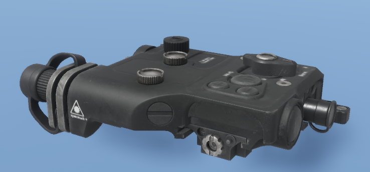

# Zenitco Perst "Klassika" V4.0


Introduced in **0.4.1033**


<figure><figcaption></figcaption></figure>

### Default key binds

| Label                                   | Keyboard                                             | Gamepad                                              | Description                                                                                      |
| --------------------------------------- | ---------------------------------------------------- | ---------------------------------------------------- | ------------------------------------------------------------------------------------------------ |
| Toggle light device                     | .png>)  | .png>) | Toggle ON/OFF device                                                                             |
| Cycle through light device modes        | .png>)  | .png>)  | Cycle through available mods - will skip OFF mode to prevent accidentally turning off the device |
| Hold to momentarly turn ON light device | .png>) | .png>) | Will turn ON the device when pressed and turn it OFF when released                               |
